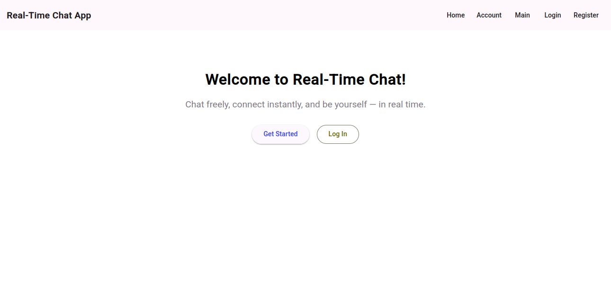
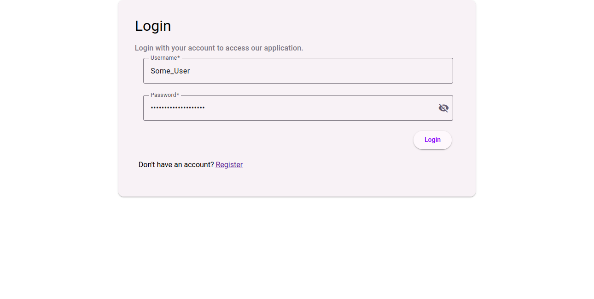
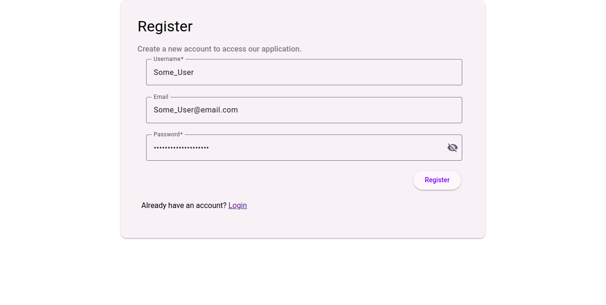
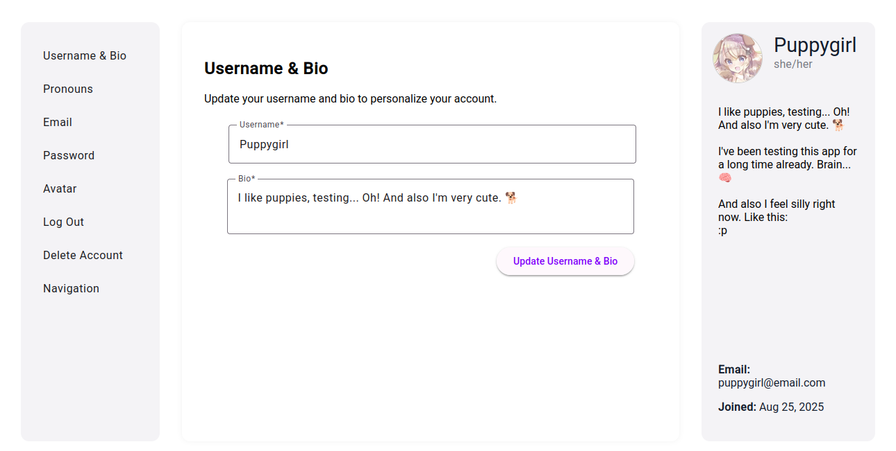
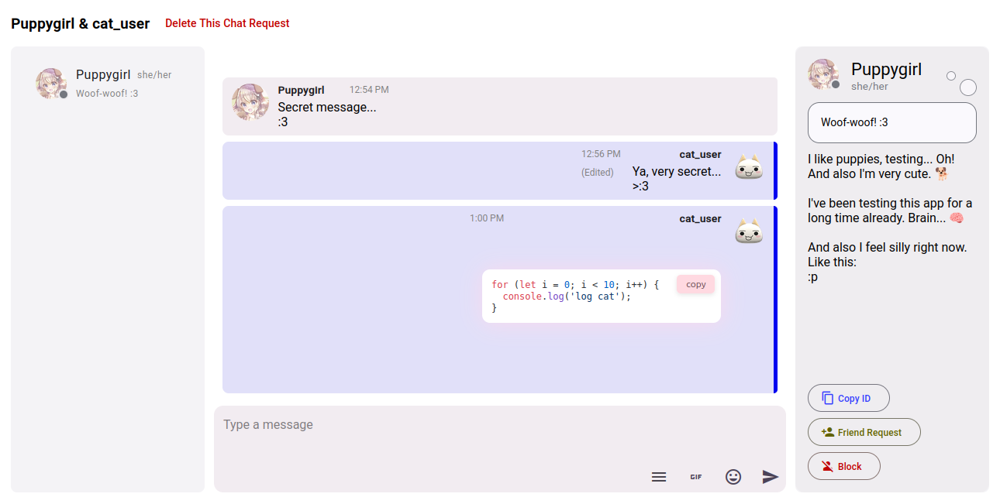

# 🟣 Real-Time Chat Application

A full-featured, real-time chat application built with **Angular**, **Node.js**, **Socket.IO**, and **MongoDB**, styled with **Angular Material**, and deployed with **Docker** and **Kubernetes**.

It supports private and public chat rooms, direct messages, friend requests, profile customization, and real-time features like typing indicators and online status.

---

## ✨ Features

### 🧵 Chat Functionality

- Real-time messaging with **Socket.IO**
- Create public and private chat rooms
- Edit, delete, reply to messages
- **Markdown formatting** (bold, italic, code, strike)
- Emoji & GIF support
- **Typing indicators**
- **Message pagination**
- Scroll preservation and reply highlighting

### 👥 Users & Authentication

- Register / Login with hashed passwords (JWT auth)
- Profile pages with editable avatar, display name, pronouns, bio, and status
- Change password and delete account
- Role-based permissions (owner, mod, etc.)

### 🫂 Friends & Private Messages

- Send, accept, and reject friend requests
- Direct (1-on-1) private chat
- View friend's status and activity

### 🧠 Reactions & Real-Time Status _(Coming soon)_

- Add emoji reactions to messages
- See who’s online, offline, or idle
- Custom user status (like “studying”, “away”, etc.)

---

## 🖼️ Screenshots

### 🌐 Landing Page



### 🔐 Login



### 📝 Register



### 👤 Account Page



### 💬 Public Chat Room


### 🔒 Private Chat Room



---

## 🧰 Tech Stack

| Layer    | Technology                                                                                                                                           |
| -------- | ---------------------------------------------------------------------------------------------------------------------------------------------------- |
| Frontend | Angular v20, SCSS, Angular Material                                                                                                                  |
| Backend  | Node.js, Express, Socket.IO                                                                                                                          |
| Auth     | JWT, Redis (token store)                                                                                                                             |
| Database | MongoDB, Mongoose                                                                                                                                    |
| Realtime | Socket.IO                                                                                                                                            |
| DevOps   | Docker, Kubernetes (Minikube)                                                                                                                        |
| Testing  | Mocha & Chai (backend), Jasmine & Karma (frontend), Cypress (E2E), Artillery (performance), LighthouseCI (standards), Clinic.Js (backend algorithms) |

---

## 📂 Project Structure

### Backend

```plaintext
.
├── Dockerfile
├── nodemon.json
├── package.json
├── package-lock.json
├── src # The source folder.
│   ├── app.ts # The main routes file.
│   ├── auth # JWT logic.
│   │   ├── auth.middleware.ts
│   │   └── jwt.service.ts
│   ├── config # Databases and environment variables.
│   │   ├── db.ts
│   │   ├── env.ts
│   │   └── redis.ts
│   ├── controllers
│   │   ├── auth.controller.ts
│   │   ├── chat.controller.ts
│   │   ├── favorites.controller.ts
│   │   ├── message.controller.ts
│   │   ├── notification.controller.ts
│   │   └── social.controller.ts
│   ├── cryptography # JWT key rotation.
│   │   ├── encrypt-decrypt.ts
│   │   ├── generate-keys.ts
│   │   └── rsa-keys-rotation.ts
│   ├── helpers
│   │   ├── account-response.ts # The responce for the user `account` page.
│   │   ├── check-role-editing-permissions.ts # Check user permissions.
│   │   └── check-role.ts # Check user roles.
│   ├── middleware # User avatar and chat room thumbnail uploads.
│   │   ├── avatar-upload.ts
│   │   └── thumbnail-upload.ts
│   ├── models
│   │   ├── channel.model.ts
│   │   ├── chat.model.ts
│   │   ├── message.model.ts
│   │   ├── notification.model.ts
│   │   └── user.model.ts
│   ├── routes
│   │   ├── auth.routes.ts
│   │   ├── chat.routes.ts
│   │   ├── favorites.routes.ts
│   │   ├── index.ts
│   │   ├── message.routes.ts
│   │   ├── notification.routes.ts
│   │   └── social.routes.ts
│   ├── server.ts # The main file.
│   ├── services
│   │   ├── chat.service.ts # Channel addings.
│   │   └── user.service.ts # Find a user.
│   ├── sockets
│   │   ├── auth.handlers.ts
│   │   ├── channel.handlers.ts
│   │   ├── index.ts
│   │   ├── member.handlers.ts
│   │   ├── mesage.handlers.ts
│   │   └── social.handlers.ts
│   └── socket.ts # The main Socket.IO file.
├── test
│   ├── app.spec.ts
│   ├── auth.middleware.spec.ts
│   ├── db.spec.ts
│   ├── env.spec.ts
│   ├── jwt.service.spec.ts
│   ├── rsa-keys-rotation.spec.ts
│   ├── socket.spec.ts
│   └── user.model.spec.ts
├── tsconfig.json
└── types # Additional TypeScript data types.
    ├── chat-room-role.alias.ts
    ├── express-extensions.d.ts
    ├── member.alias.ts
    ├── mongoose-extensions.d.ts
    └── populated-user.interface.ts
```

### Frontend

```plaintext
.
├── angular.json
├── Dockerfile
├── package.json
├── package-lock.json
├── public
│   ├── assets
│   │   └── camera.svg
│   └── favicon.ico
├── README.md
├── src
│   ├── app
│   │   ├── account-page
│   │   │   ├── account
│   │   │   │   ├── account.component.html
│   │   │   │   ├── account.component.scss
│   │   │   │   ├── account.component.spec.ts
│   │   │   │   └── account.component.ts
│   │   │   ├── account-email
│   │   │   │   ├── account-email.component.html
│   │   │   │   ├── account-email.component.scss
│   │   │   │   ├── account-email.component.spec.ts
│   │   │   │   └── account-email.component.ts
│   │   │   ├── avatar
│   │   │   │   ├── avatar.component.html
│   │   │   │   ├── avatar.component.scss
│   │   │   │   ├── avatar.component.spec.ts
│   │   │   │   └── avatar.component.ts
│   │   │   ├── delete-account
│   │   │   │   ├── delete-account.component.html
│   │   │   │   ├── delete-account.component.scss
│   │   │   │   ├── delete-account.component.spec.ts
│   │   │   │   └── delete-account.component.ts
│   │   │   ├── logout
│   │   │   │   ├── logout.component.html
│   │   │   │   ├── logout.component.scss
│   │   │   │   ├── logout.component.spec.ts
│   │   │   │   └── logout.component.ts
│   │   │   ├── password
│   │   │   │   ├── password.component.html
│   │   │   │   ├── password.component.scss
│   │   │   │   ├── password.component.spec.ts
│   │   │   │   └── password.component.ts
│   │   │   ├── pronouns
│   │   │   │   ├── pronouns.component.html
│   │   │   │   ├── pronouns.component.scss
│   │   │   │   ├── pronouns.component.spec.ts
│   │   │   │   └── pronouns.component.ts
│   │   │   ├── user-card
│   │   │   │   ├── user-card.component.html
│   │   │   │   ├── user-card.component.scss
│   │   │   │   ├── user-card.component.spec.ts
│   │   │   │   └── user-card.component.ts
│   │   │   └── username-bio
│   │   │       ├── username-bio.component.html
│   │   │       ├── username-bio.component.scss
│   │   │       ├── username-bio.component.spec.ts
│   │   │       └── username-bio.component.ts
│   │   ├── app.component.html
│   │   ├── app.component.scss
│   │   ├── app.component.spec.ts
│   │   ├── app.component.ts
│   │   ├── app.config.server.ts
│   │   ├── app.config.ts
│   │   ├── app.routes.server.ts
│   │   ├── app.routes.ts
│   │   ├── auth
│   │   │   ├── auth.guard.spec.ts
│   │   │   ├── auth.guard.ts # Authorization checking.
│   │   │   ├── auth.service.spec.ts
│   │   │   ├── auth.service.ts # Account service.
│   │   │   ├── login
│   │   │   │   ├── login.component.html
│   │   │   │   ├── login.component.scss
│   │   │   │   ├── login.component.spec.ts
│   │   │   │   └── login.component.ts
│   │   │   ├── register
│   │   │   │   ├── register.component.html
│   │   │   │   ├── register.component.scss
│   │   │   │   ├── register.component.spec.ts
│   │   │   │   └── register.component.ts
│   │   │   └── shared
│   │   │       ├── auth-form-field # The from field for all authorizations.
│   │   │       │   ├── auth-form-field.component.html
│   │   │       │   ├── auth-form-field.component.scss
│   │   │       │   ├── auth-form-field.component.spec.ts
│   │   │       │   └── auth-form-field.component.ts
│   │   │       ├── auth-interceptor # Get the JWT access token.
│   │   │       │   ├── auth.interceptor.spec.ts
│   │   │       │   └── auth.interceptor.ts
│   │   │       ├── error-interceptor # Catch the 401 error.
│   │   │       │   ├── error.interceptor.spec.ts
│   │   │       │   └── error.interceptor.ts
│   │   │       ├── services
│   │   │       │   ├── auth-token.service.spec.ts
│   │   │       │   └── auth-token.service.ts # Get the access JWT token.
│   │   │       └── user.model.ts # The user account data interface for the `account` page.
│   │   ├── chat
│   │   │   ├── chat-room-page
│   │   │   │   ├── channel-list
│   │   │   │   │   ├── channel-list.component.html
│   │   │   │   │   ├── channel-list.component.scss
│   │   │   │   │   ├── channel-list.component.spec.ts
│   │   │   │   │   └── channel-list.component.ts
│   │   │   │   ├── channel-topic
│   │   │   │   │   ├── channel-topic.component.html
│   │   │   │   │   ├── channel-topic.component.scss
│   │   │   │   │   ├── channel-topic.component.spec.ts
│   │   │   │   │   └── channel-topic.component.ts
│   │   │   │   ├── chat-room
│   │   │   │   │   ├── chat-room.component.html
│   │   │   │   │   ├── chat-room.component.scss
│   │   │   │   │   ├── chat-room.component.spec.ts
│   │   │   │   │   └── chat-room.component.ts
│   │   │   │   ├── chat-room-settings # Chat room creation/deletion and topic.
│   │   │   │   │   ├── chat-room-settings.component.html
│   │   │   │   │   ├── chat-room-settings.component.scss
│   │   │   │   │   ├── chat-room-settings.component.spec.ts
│   │   │   │   │   └── chat-room-settings.component.ts
│   │   │   │   ├── member-list
│   │   │   │   │   ├── member-list.component.html
│   │   │   │   │   ├── member-list.component.scss
│   │   │   │   │   ├── member-list.component.spec.ts
│   │   │   │   │   └── member-list.component.ts
│   │   │   │   ├── message-input
│   │   │   │   │   ├── message-input.component.html
│   │   │   │   │   ├── message-input.component.scss
│   │   │   │   │   ├── message-input.component.spec.ts
│   │   │   │   │   └── message-input.component.ts
│   │   │   │   ├── message-list
│   │   │   │   │   ├── message-list.component.html
│   │   │   │   │   ├── message-list.component.scss
│   │   │   │   │   ├── message-list.component.spec.ts
│   │   │   │   │   └── message-list.component.ts
│   │   │   │   ├── permissions # Manage creating role permissons.
│   │   │   │   │   ├── permissions.component.html
│   │   │   │   │   ├── permissions.component.scss
│   │   │   │   │   ├── permissions.component.spec.ts
│   │   │   │   │   └── permissions.component.ts
│   │   │   │   ├── private-friend-list
│   │   │   │   │   ├── private-friend-list.component.html
│   │   │   │   │   ├── private-friend-list.component.scss
│   │   │   │   │   ├── private-friend-list.component.spec.ts
│   │   │   │   │   └── private-friend-list.component.ts
│   │   │   │   ├── private-user-card
│   │   │   │   │   ├── private-user-card.component.html
│   │   │   │   │   ├── private-user-card.component.scss
│   │   │   │   │   ├── private-user-card.component.spec.ts
│   │   │   │   │   └── private-user-card.component.ts
│   │   │   │   └── role-management # Create/delete roles.
│   │   │   │       ├── role-management.component.html
│   │   │   │       ├── role-management.component.scss
│   │   │   │       ├── role-management.component.spec.ts
│   │   │   │       └── role-management.component.ts
│   │   │   ├── dialogs
│   │   │   │   ├── chat-room-settings-dialog
│   │   │   │   │   ├── chat-room-settings-dialog.component.html
│   │   │   │   │   ├── chat-room-settings-dialog.component.scss
│   │   │   │   │   ├── chat-room-settings-dialog.component.spec.ts
│   │   │   │   │   └── chat-room-settings-dialog.component.ts
│   │   │   │   ├── delete-channel-dialog
│   │   │   │   │   ├── delete-channel-dialog.component.html
│   │   │   │   │   ├── delete-channel-dialog.component.scss
│   │   │   │   │   ├── delete-channel-dialog.component.spec.ts
│   │   │   │   │   └── delete-channel-dialog.component.ts
│   │   │   │   ├── permissions-dialog
│   │   │   │   │   ├── permissions-dialog.component.html
│   │   │   │   │   ├── permissions-dialog.component.scss
│   │   │   │   │   ├── permissions-dialog.component.spec.ts
│   │   │   │   │   └── permissions-dialog.component.ts
│   │   │   │   ├── rename-channel-dialog
│   │   │   │   │   ├── rename-channel-dialog.component.html
│   │   │   │   │   ├── rename-channel-dialog.component.scss
│   │   │   │   │   ├── rename-channel-dialog.component.spec.ts
│   │   │   │   │   └── rename-channel-dialog.component.ts
│   │   │   │   └── user-card-dialog
│   │   │   │       ├── user-card-dialog.component.html
│   │   │   │       ├── user-card-dialog.component.scss
│   │   │   │       ├── user-card-dialog.component.spec.ts
│   │   │   │       └── user-card-dialog.component.ts
│   │   │   ├── main-page
│   │   │   │   ├── chat-room-list
│   │   │   │   │   ├── chat-room-list.component.html
│   │   │   │   │   ├── chat-room-list.component.scss
│   │   │   │   │   ├── chat-room-list.component.spec.ts
│   │   │   │   │   └── chat-room-list.component.ts
│   │   │   │   ├── friend-list
│   │   │   │   │   ├── friend-list.component.html
│   │   │   │   │   ├── friend-list.component.scss
│   │   │   │   │   ├── friend-list.component.spec.ts
│   │   │   │   │   └── friend-list.component.ts
│   │   │   │   ├── header
│   │   │   │   │   ├── header.component.html
│   │   │   │   │   ├── header.component.scss
│   │   │   │   │   ├── header.component.spec.ts
│   │   │   │   │   └── header.component.ts
│   │   │   │   ├── main
│   │   │   │   │   ├── main.component.html
│   │   │   │   │   ├── main.component.scss
│   │   │   │   │   ├── main.component.spec.ts
│   │   │   │   │   └── main.component.ts
│   │   │   │   └── notification-list
│   │   │   │       ├── notification-list.component.html
│   │   │   │       ├── notification-list.component.scss
│   │   │   │       ├── notification-list.component.spec.ts
│   │   │   │       └── notification-list.component.ts
│   │   │   └── shared
│   │   │       ├── models # Interfaces.
│   │   │       │   ├── channel.model.ts
│   │   │       │   ├── chat.model.ts
│   │   │       │   ├── chat-room-roles.alias.ts
│   │   │       │   ├── chat-rooms.interface.ts
│   │   │       │   ├── member.alias.ts
│   │   │       │   ├── message.model.ts
│   │   │       │   ├── notification.model.ts
│   │   │       │   ├── permissions.alias.ts
│   │   │       │   ├── populated-user.model.ts
│   │   │       │   └── private-chat-room.model.ts
│   │   │       └── services
│   │   │           ├── chat-service
│   │   │           │   ├── chat.service.spec.ts
│   │   │           │   └── chat.service.ts # All HTTP(S) requests for chat rooms.
│   │   │           └── websocket
│   │   │               ├── websocket.service.spec.ts
│   │   │               └── websocket.service.ts # All Socket.IO requests.
│   │   ├── home
│   │   │   ├── home.component.html
│   │   │   ├── home.component.scss
│   │   │   ├── home.component.spec.ts
│   │   │   └── home.component.ts
│   │   ├── shared
│   │   │   ├── components
│   │   │   │   └── gif-picker
│   │   │   │       ├── gif-picker.component.html
│   │   │   │       ├── gif-picker.component.scss
│   │   │   │       ├── gif-picker.component.spec.ts
│   │   │   │       └── gif-picker.component.ts
│   │   │   ├── pipes
│   │   │   │   └── text-format
│   │   │   │       ├── text-format.pipe.spec.ts
│   │   │   │       └── text-format.pipe.ts # The text markdown pipe.
│   │   │   └── services
│   │   │       └── gif
│   │   │           ├── gif.service.spec.ts
│   │   │           └── gif.service.ts
│   │   └── unauthorized
│   │       ├── unauthorized.component.html
│   │       ├── unauthorized.component.scss
│   │       ├── unauthorized.component.spec.ts
│   │       └── unauthorized.component.ts
│   ├── environments
│   │   └── environment.ts # The environment file.
│   ├── index.html
│   ├── main.server.ts
│   ├── main.ts
│   ├── server.ts
│   ├── styles
│   │   ├── emoji.scss
│   │   ├── image-gif.scss
│   │   ├── message-video.scss
│   │   ├── star.scss
│   │   └── text-formatting.scss
│   └── styles.scss
├── tsconfig.app.json
├── tsconfig.json
└── tsconfig.spec.json
```

## Start the Project

### **In the Development Mode**

To start this project in the development mode use these commands:

```bash
cd backend
npm install
npm start

```

And then open a new terminal and run this:

```bash
cd frontend
npm install
npm start

```

## Docker & Kubernetes Deployments

The deployments are placed in the [`docker-kubernetes-deployments`](./docker-kubernetes-deployments) folder.

- **[MongoDB](./docker-kubernetes-deployments/mongodb-deployments/mongodb/)**
- **[MongoDB Express](./docker-kubernetes-deployments/mongodb-deployments/mongodb-express/)**
- **[This preject:](./docker-kubernetes-deployments/real-time-chat-app-deployment/)** Images are deployed with Docker. Uses `docker compose` and K8s ingress.

## License

This project is licensed under the MIT License. See the [LICENSE](./LICENSE) file for details.
